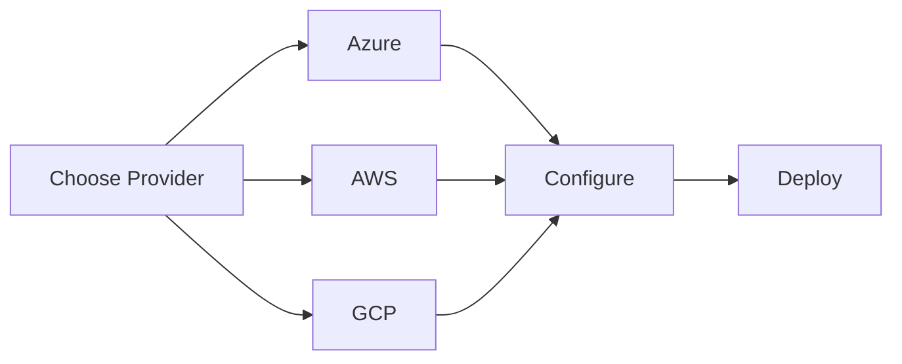
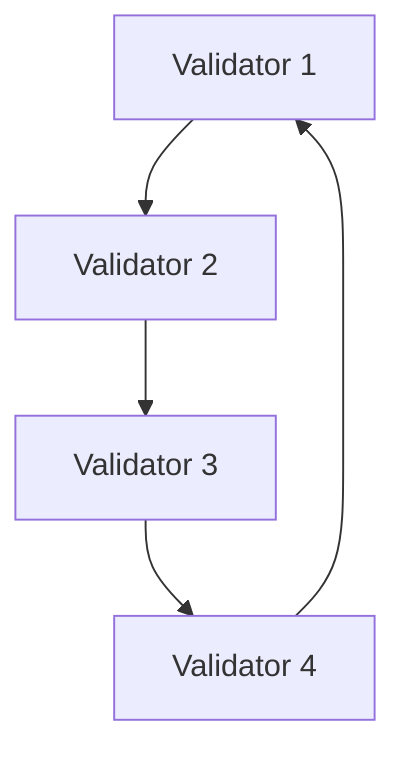

# 138-Mainnet Web3 Configurator

<div align="center">
  
  
  [](https://portal.azure.com/#create/Microsoft.Template/uri/...)
  [](./deploy/aws)
  [](https://demo.138-mainnet.network)
</div>

Next-Gen Web3 Configurator for Hyperledger Besu & 138-Mainnet featuring gesture control, 3D visualization, and Web3Auth integration.

## Features

- 🔐 Web3Auth Integration
- 👋 Gesture-Based UI Control
- 🎮 3D Network Visualization
- 📊 Real-Time Blockchain Monitoring
- 🚀 Smart Contract Management

## Setup

```bash
npm install
npm run dev
```

## Technology Stack

- Frontend: Next.js, Three.js, TailwindCSS
- Blockchain: Hyperledger Besu, Web3.js, Ethers.js
- Authentication: Web3Auth
- Zero-Knowledge: Hyperledger Identus, PolygonID, Dock Labs SDK
- Gesture Recognition: TensorFlow.js
- 3D Graphics: Three.js + Babylon.js

## Environment Variables

Create a `.env.local` file with:

```
NEXT_PUBLIC_WEB3AUTH_CLIENT_ID=
NEXT_PUBLIC_RPC_URL=
DOCK_API_KEY=
POLYGON_ID_CONTRACT=
IDENTUS_VERIFIER_KEY=
```

## Architecture

```
src/
├── components/     # React components
├── config/        # Configuration files
├── hooks/         # Custom React hooks
├── pages/         # Next.js pages
├── styles/        # CSS and styling
└── utils/         # Utility functions
```

## Smart Contract Integration

1. Connect your wallet using Web3Auth
2. Access the contract dashboard
3. Deploy or interact with existing contracts
4. Monitor transaction status

## Gesture Controls

- 👆 Point: Select nodes
- ✌️ Two fingers: Rotate view
- 🤚 Palm: Pan camera
- 👊 Fist: Reset view

## Interactive Network Visualization 🌐

View our network in real-time:
- 🔄 [Live Network Status](https://status.138-mainnet.network)
- 🎮 [3D Explorer](https://explorer.138-mainnet.network)
- 📊 [Analytics Dashboard](https://metrics.138-mainnet.network)

<div align="center">
  
</div>

## Automated Deployment Options

### One-Click Deployments


### Custom Installation

Choose your components:
- [ ] Core Node
- [ ] Web3Auth Integration
- [ ] Gesture Control
- [ ] 3D Visualization
- [ ] IPFS Storage
- [ ] Smart Contract Suite

```bash
# Custom installation with selected components
./install.sh --components "core,web3auth,gesture,3d"
```

## À La Carte Customization

### 1. Node Configuration
```yaml
node:
  consensus: IBFT2/QBFT/Clique
  plugins: [privacy, metrics, traces]
  performance:
    txpool: 4096
    cache: 2048MB
```

### 2. Network Topology


### 3. Smart Contract Integration
Choose from pre-built modules:
- 🔐 Access Control
- 💱 Token Standards
- 🤝 Multi-sig Wallets
- 🔄 Cross-chain Bridges

## Zero-Knowledge Integration

The platform supports zero-knowledge proofs through:
- Hyperledger Identus for claim generation
- PolygonID for proof verification
- Dock Labs SDK for anchoring and storage

```typescript
// Generate and verify ZK proofs
const zkModule = new ZKModule(config);
const proof = await zkModule.generateProof(claim);
const isValid = await zkModule.verifyProof(proof);
```

## Real-Time Modifications

Monitor and modify your network in real-time:
```javascript
// Live configuration updates
await network.updateConfig({
  consensus: {
    blockTime: 2,
    validators: [...],
  },
  scaling: {
    maxPeers: 50,
    txPoolSize: 8192
  }
});
```

## Version Control & Updates

Track your network configuration:
```bash
# Save current state
net138 snapshot create

# Roll back changes
net138 snapshot restore <timestamp>

# Update components
net138 update --components all
```

## Development

```bash
# Install dependencies
npm install

# Run development server
npm run dev

# Run tests
npm test

# Build for production
npm run build
```

## Testing

```bash
# Unit tests
npm run test:unit

# E2E tests
npm run test:e2e

# Integration tests
npm run test:integration
```

## Deployment

1. Build the application:
   ```bash
   npm run build
   ```

2. Deploy to your preferred hosting:
   ```bash
   npm run deploy
   ```

## Contributing

1. Fork the repository
2. Create feature branch
3. Commit changes
4. Push to branch
5. Create Pull Request

## License

MIT License

## Support

- Discord: [Join Our Community]
- Twitter: [@138Network]
- Email: support@138.network

## Security

Report vulnerabilities to security@138.network

## Interactive Support

<div align="center">
  <h3>Need Help? Connect with us:</h3>
  <a href="https://discord.gg/138-mainnet">
    
  </a>
  <a href="https://t.me/138mainnet">
    
  </a>
</div>

## Deployment Status

| Component | Status | Version |
|-----------|--------|---------|
| Core Node | []() | v1.0.0 |
| Web3Auth | []() | v2.1.3 |
| Smart Contracts | []() | v1.2.0 |

<div align="center">
  
</div>

# Hyperledger Besu Deployment Configuration

## 🚀 Quick Start

Run the deployment script with your chosen configuration:
```bash
./scripts/orchestrate-deployment.sh <consensus> <features> <version> [options]
```

## 📋 Decision Tree

### 1️⃣ Choose Cloud Provider
- [ ] AWS
- [ ] Azure
- [ ] Multi-Cloud

### 2️⃣ Select Deployment Type
- [ ] Single VM (Basic)
- [ ] Multi-VM (Distributed)
- [ ] Kubernetes (Multi-Region)
- [ ] Multi-Tenant Stack

[Decision tree content continues as specified in the prompt...]

## 🛠 Configuration Options

```json
{
  "deployment": {
    "type": "kubernetes|vm|multi-vm",
    "provider": "aws|azure|multi-cloud",
    "consensus": "ibft2|clique|pow|pos",
    "features": ["metrics", "traces"],
    "multiTenant": {
      "enabled": false,
      "components": ["firefly", "cacti"]
    }
  }
}
```

[Rest of the documentation as specified...]